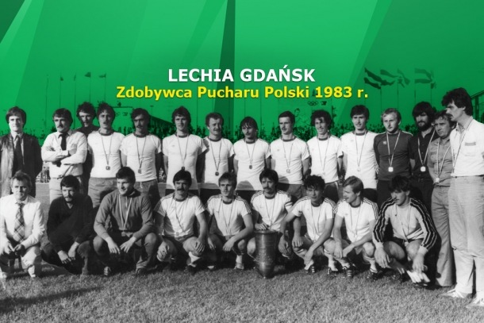

# Lechia Gdańsk w dużym skrócie:+1:

>*My wierzymy tylko w BKS*

## Odrobina historii:
Klub został założony w sierpniu 1945 w Gdańsku jako Klub Sportowy Biura Odbudowy Portów „Baltia”. W 1946 jego nazwę zmieniono na „Lechia”. Pierwszy awans do I ligi uzyskał w 1948. Po rocznym pobycie w najwyższej klasie rozgrywkowej klub spadł w 1949 do II ligi. Po raz drugi gdański klub, noszący wówczas nazwę „Budowlani”, awansował do I ligi w 1951 i spadł z niej w 1953 na jeden sezon. W rozgrywkach sezonu 1956 klub uplasował się na trzeciej pozycji w tabeli, co jest największym sukcesem w jego dotychczasowej historii.


## Lata 1982-2008:
Na początku lat osiemdziesiątych sponsorem BKS Lechia został Nikodem Skotarczak (ps. „Nikoś”). Za jego kadencji rozpoczęło się odrodzenie klubu z Gdańska i już w sezonie 1982/83 III-ligowy zespół Lechii wywalczył awans do II ligi, zdobył Puchar Polski i triumfował w historycznym, pierwszym meczu o Superpuchar Polski pokonując 30 lipca 1983 na gdańskim Stadionie Miejskim Mistrza Polski Lecha Poznań 1:0 (spotkanie prowadził Henryk Klocek z OZPN Gdańsk). Zdobycie Pucharu Polski premiowane było udziałem w rozgrywkach Pucharu Zdobywców Pucharów, gdzie w pierwszej rundzie Lechia trafiła na sławny Juventus z 5 mistrzami świata z '82 roku w składzie. Gdańszczanie ulegli, jak się później okazało, późniejszemu zwycięzcy rozgrywek PZP dwukrotnie: 0:7 w Turynie i 2:3 w Gdańsku (28 września 1983). W kolejnym sezonie klub znad Motławy wywalczył awans do I ligi, a Jerzy Kruszczyński zdobył tytuł króla strzelców II ligi.


- [x] założyć konto na GitHub
- [x] rozpoznać się w temacie _secure shell_
 


#Programujemy w C

```c
main () {
printf("hello world\n");
return 0;
}
```
