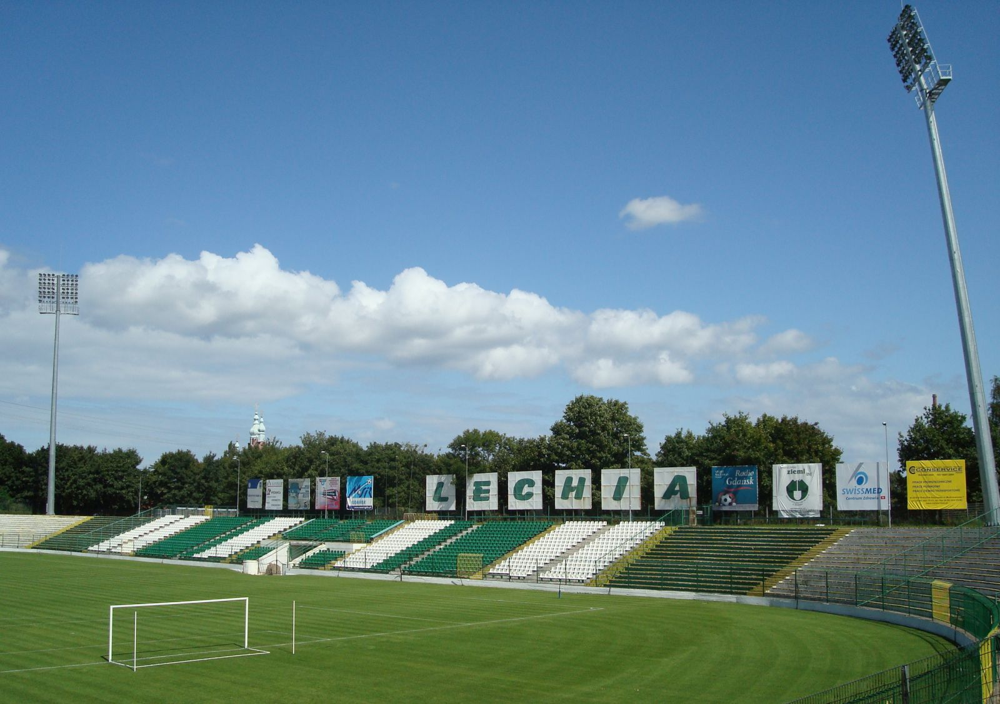
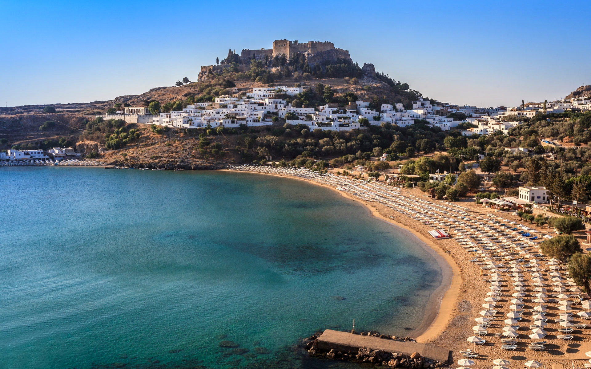

# Lechia Gdańsk w dużym skrócie:+1:

>*My wierzymy tylko w BKS*

## Odrobina historii
Klub został założony w sierpniu 1945 w Gdańsku jako Klub Sportowy Biura Odbudowy Portów „Baltia”. W 1946 jego nazwę zmieniono na „Lechia”. Pierwszy awans do I ligi uzyskał w 1948. Po rocznym pobycie w najwyższej klasie rozgrywkowej klub spadł w 1949 do II ligi. Po raz drugi gdański klub, noszący wówczas nazwę „Budowlani”, awansował do I ligi w 1951 i spadł z niej w 1953 na jeden sezon. W rozgrywkach sezonu 1956 klub uplasował się na trzeciej pozycji w tabeli, co jest największym sukcesem w jego dotychczasowej historii.



- [x] założyć konto na GitHub
- [x] rozpoznać się w temacie _secure shell_
 


#Programujemy w C

```c
main () {
printf("hello world\n");
return 0;
}
```
